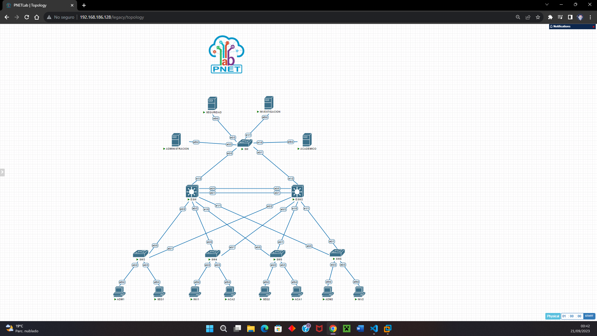
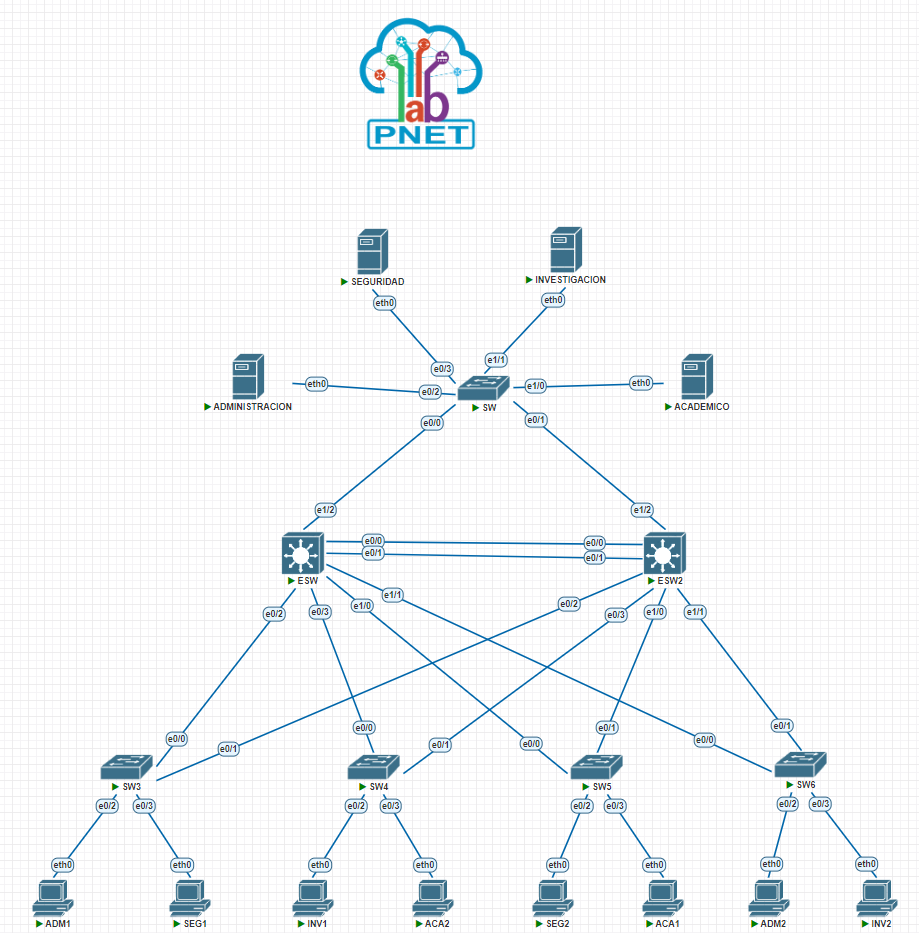
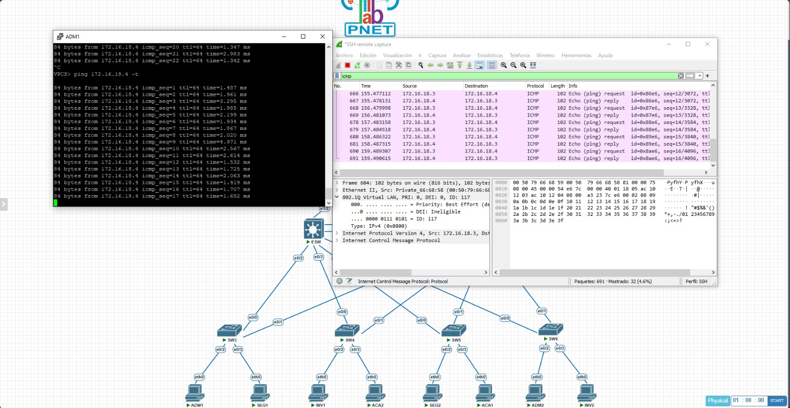
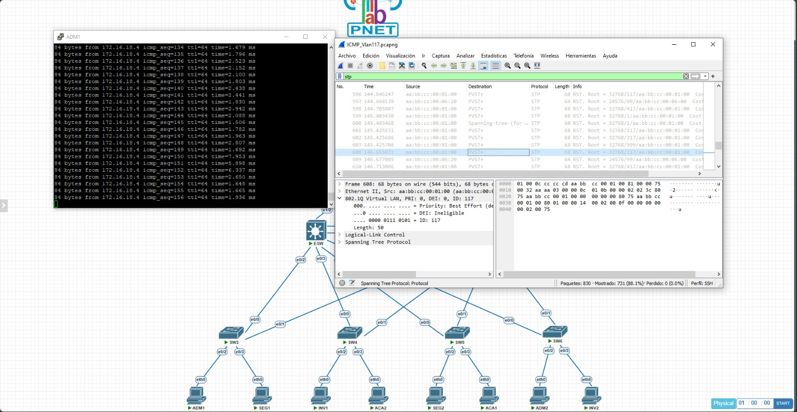

### **Universidad San Carlos de Guatemala**
### **Facultad de Ingeniería**
### **Escuela de Ciencias y Sistemas**
### **Redes de Computadoras 1 N**
### **Catedrático: Ing. Pedro Pablo Hernández Ramírez**
### **Auxiliar: Edwin López**

## **Manual Técnico - Proyecto 1**

- **Estuardo Gabriel Son Mux – 202003894**
- **Angel Eduardo Marroquín Canizales – 202003959**
---
## **Tabla de direcciones**

| Nombre del dispositivo | IP   | Máscara de subred | Gateway | VLAN |
|------------------------|------|-------------------|---------|------|
|ADMINISTRACION|172.16.18.2|255.255.255.0|172.16.18.1|117|
|ADM1|172.16.18.3|255.255.255.0|172.16.18.1|117|
|ADM2|172.16.18.4|255.255.255.0|172.16.18.1|117|
|ACADEMICO|172.16.19.2|255.255.255.0|172.16.19.1|217|
|ACA1|172.16.19.3|255.255.255.0|172.16.19.1|217|
|ACA2|172.16.19.4|255.255.255.0|172.16.19.1|217|
|INVESTIGACION|172.16.20.2|255.255.255.0|172.16.20.1|317|
|INV1|172.16.20.3|255.255.255.0|172.16.20.1|317|
|INV2|172.16.20.4|255.255.255.0|172.16.20.1|317|
|SEGURIDAD|172.16.21.2|255.255.255.0|172.16.21.1|417|
|SEG1|172.16.21.3|255.255.255.0|172.16.21.1|417|
|SEG2|172.16.21.4|255.255.255.0|172.16.21.1|417|

## **Implementación de la topología**




## **Comandos**

**ESW1**
```
configure terminal

hostname ESW

vlan 99
name Nativa

vlan 117
name Administracion

vlan 217
name Academico

vlan 317
name Investigaciones

vlan 417
name Seguridad

vlan 999
name Blackhole

vtp version 2
vtp mode server
vtp domain pareja17
vtp password usac

spanning-tree mode rapid-pvst
spanning-tree vlan 99 root primary

interface Ethernet0/0
no shutdown
switchport trunk encapsulation dot1q
switchport trunk native vlan 99
switchport mode trunk

interface Ethernet0/1
no shutdown
switchport trunk encapsulation dot1q
switchport trunk native vlan 99
switchport mode trunk

interface Ethernet0/2
no shutdown
switchport trunk encapsulation dot1q
switchport trunk native vlan 99
switchport mode trunk

interface Ethernet0/3
no shutdown
switchport trunk encapsulation dot1q
switchport trunk native vlan 99
switchport mode trunk

interface Ethernet1/0
no shutdown
switchport trunk encapsulation dot1q
switchport trunk native vlan 99
switchport mode trunk

interface Ethernet1/1
no shutdown
switchport trunk encapsulation dot1q
switchport trunk native vlan 99
switchport mode trunk

interface Ethernet1/2
no shutdown
switchport trunk encapsulation dot1q
switchport trunk native vlan 99
switchport mode trunk

interface Ethernet1/3
no shutdown
switchport access vlan 999
switchport mode access
```
**SW5**
```
configure terminal

hostname SW5

vtp version 2
vtp mode client
vtp domain pareja17
vtp password usac

spanning-tree mode rapid-pvst
spanning-tree vlan 99

interface Ethernet0/0
no shutdown
switchport trunk encapsulation dot1q
switchport trunk native vlan 99
switchport mode trunk

interface Ethernet0/1
no shutdown
switchport trunk encapsulation dot1q
switchport trunk native vlan 99
switchport mode trunk

interface Ethernet0/2
no shutdown
switchport access vlan 417
switchport mode access

interface Ethernet0/3
no shutdown
switchport access vlan 217
switchport mode access

```
**SW**
```
configure terminal

hostname SW

vtp version 2
vtp mode client
vtp domain pareja17
vtp password usac

spanning-tree mode rapid-pvst
spanning-tree vlan 99

interface Ethernet0/0
no shutdown
switchport trunk encapsulation dot1q
switchport trunk native vlan 99
switchport mode trunk

interface Ethernet0/1
no shutdown
switchport trunk encapsulation dot1q
switchport trunk native vlan 99
switchport mode trunk

interface Ethernet0/2
no shutdown
switchport access vlan 117
switchport mode access

interface Ethernet0/3
no shutdown
switchport access vlan 417
switchport mode access

interface Ethernet1/0
no shutdown
switchport access vlan 217
switchport mode access

interface Ethernet1/1
no shutdown
switchport access vlan 317
switchport mode access

interface Ethernet1/2
no shutdown
switchport access vlan 999
switchport mode access

interface Ethernet1/3
no shutdown
switchport access vlan 999
switchport mode access
```

## **Capturas de Wireshark**
**VLAN 117**


**STP 117**


## **Presupuesto**
| Dispositivo | Fabricante | Modelo | Cantidad | Precio Unidad | Información Adicional|
|-------------|------------|--------|----------|---------------|------------|
| Switch L2 | UBIQUITI | USW-FLEX-MINI | 4 | Q450.00 |  Switch de Capa 2 completamente administrado con (5) puertos GbE RJ45, incluida (1) entrada PoE |
| Switch L2 | UBIQUITI | US-8-60W | 1 | Q1419.00 |  Switch capa 2 de 8 puertos |
| Switch L3 | Mikrotik | CRS212-1G-10S-1S+IN | 2 | Q2186.00 |  Switch capa 3 de 10 puertos SFP 1x SFP+, Smart Switch, 400 MHz CPU 64 MB RAM|
| Cable UTP Cat 6| Nexxt Solutions| AB356NXT01| 150 m | Q5.49 x m | UTP Cat 6 calibre 23 awg |
| Conector RJ45 | Nexxt Solutions | AW102NXT04 | 48 | Q4.00 | Conector RJ45 categoría 6 |

**Computadoras**  
Se necesitaran de 8 computadoras capaces de conectarse a la red a implementar. El sistema operativo, así como las especificaciones de cada computadora quedan a elección de la universidad.

**Servidores**  
Se necesitaran de 4 servidores para la red, las especificaciones y requerimientos quedan a discreción de la universidad.

### **Total estimado:** Q.8606.50 + costo de las computadoras y srvidores*
*No se incluyen costos de instalación 