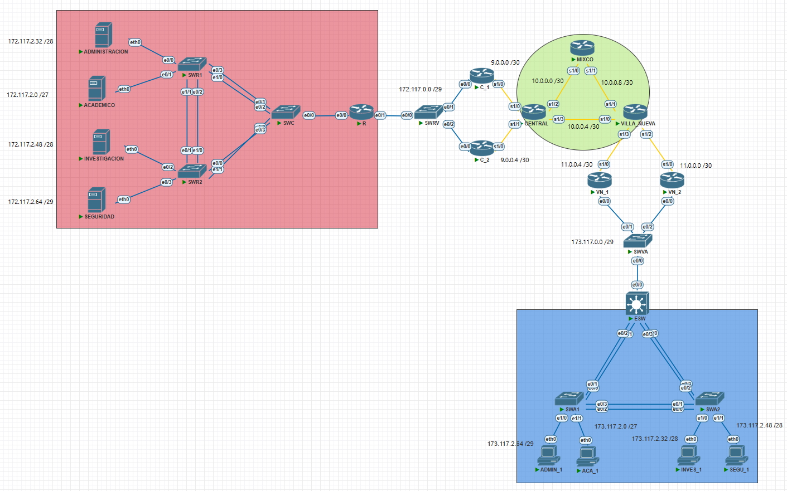

### **Universidad San Carlos de Guatemala**
### **Facultad de Ingeniería**
### **Escuela de Ciencias y Sistemas**
### **Redes de Computadoras 1 N**
### **Catedrático: Ing. Pedro Pablo Hernández Ramírez**
### **Auxiliar: Edwin López**

## **Manual Técnico - Proyecto 2**

- **Estuardo Gabriel Son Mux – 202003894**
- **Angel Eduardo Marroquín Canizales – 202003959**

## **Topología**

## **Tablas de Redes**
### **Sede Central**
| Red | Subred | Rango Usable | Hosts disponibles | Máscara de subred | Gateway | VLAN |
|-----|--------|--------------|------------------|-------------------|---------|------|
| 172.117.2.0 /24  | 172.117.2.0 /27 | 172.117.2.1 - 172.117.2.30 | 30 | 255.255.255.224 | 172.117.2.1 | 17 | 
|| 172.117.2.32 /28 | 172.117.2.33 - 172.117.2.46 | 14 | 255.255.255.240 | 172.117.2.33 | 37 |
|| 172.117.2.48 /28 | 172.117.2.49 - 172.117.2.62 | 14 | 255.255.255.240 | 172.117.2.49 | 27 |
|| 172.117.2.64 /29 | 172.117.2.65 - 172.117.2.70 | 6 | 255.255.255.248 | 172.117.2.65 | 47 |   

### **Sede Villa Nueva**
| Red | Subred | Rango Usable | Hosts disponibles | Máscara de subred | Gateway | VLAN |
|-----|--------|--------------|-------------------|-------------------|---------|------|
| 173.117.2.0 /24 | 173.117.2.0 /27 | 173.117.2.1 - 173.117.2.30 | 30 | 255.255.255.224 | 172.117.2.1 | 37 |
| | 173.117.2.32 /28 | 173.117.2.33 - 173.117.2.46 | 14 | 255.255.255.240 | 172.117.2.33 | 57 |
| | 173.117.2.48 /28 | 173.117.2.49 - 173.117.2.62 | 14 | 255.255.255.240 | 172.117.2.49 | 27 |
| | 173.117.2.64 /29 | 173.117.2.65 - 173.117.2.70 | 6 | 255.255.255.248 | 172.117.2.65 | 17 |

### **Red Entre R y Routers C**
| Red | Subred | Hosts disponibles |  Rango Usable | Máscara de subred |
|-----|--------|-------------------|---------------|-------------------|
| 172.117.0.0 /29 | - | 172.117.0.1 - 172.117.0.6 | 6 | 255.255.255.248 |
 
### **Red Entre Routers C y Core**
| Red | Subred | Hosts disponibles |  Rango Usable | Máscara de subred |
|-----|--------|-------------------|---------------|-------------------|
| 9.0.0.0 /28 | 9.0.0.0 /30 | 9.0.0.1 - 9.0.0.2 | 2 | 255.255.255.252 |
| | 9.0.0.4 /30 | 9.0.0.5 - 9.0.0.6 | 2 | 255.255.255.252 |

### **Red Entre Core y Routers VN**
| Red | Subred | Hosts disponibles |  Rango Usable | Máscara de subred |
|-----|--------|-------------------|---------------|-------------------|
| 11.0.0.0 /28 | 11.0.0.0 /30 | 11.0.0.1 - 11.0.0.2 | 2 | 255.255.255.252 |
| | 11.0.0.4 /30 | 11.0.0.5 - 11.0.0.6 | 2 | 255.255.255.252 |

### **Red Entre Routers VN y ESW**
| Red | Subred | Hosts disponibles |  Rango Usable | Máscara de subred |
|-----|--------|-------------------|---------------|-------------------|
| 173.117.0.0 /29 | - | 173.117.0.1 - 173.117.0.6 | 6 | 255.255.255.248 |

### **Core**
| Red | Subred | Hosts disponibles |  Rango Usable | Máscara de subred |
|-----|--------|-------------------|---------------|-------------------|
| 10.0.0.0 /28 | 10.0.0.0 /30 | 10.0.0.1 - 10.0.0.2 | 2 | 255.255.255.252 |
| | 10.0.0.4 /30 | 10.0.0.5 - 10.0.0.6 | 2 | 255.255.255.252 |
| | 10.0.0.8 /30 | 10.0.0.9 - 10.0.0.10 | 2 | 255.255.255.252 |

## **Tablas de direcciones**

| Nombre del dispositivo | IP   | Máscara de subred | Gateway | VLAN |
|------------------------|------|-------------------|---------|------|
|ADMINISTRACION|172.117.2.2|255.255.255.240|172.117.2.1|37|
|ACADEMICO|172.117.2.34|255.255.255.224|172.117.2.33|17|
|INVESTIGACION|172.117.2.66|255.255.255.240|172.117.2.65|27|
|SEGURIDAD|172.117.2.50|255.255.255.248|172.117.2.49|47|
|ADMIN_1|173.117.2.66|255.255.255.248|173.117.2.65|17|
|ACA_1|173.117.2.2|255.255.255.224|173.117.2.1|37|
|INVES_1|173.117.2.34|255.255.255.240|173.117.2.33|57|
|SEGU_1|173.117.2.50|255.255.255.240|173.117.2.49|27|

## **Direcciones IP utilizadas**
| Dispositivo | Interfaz | IP | Mascara de Subred |
| ----------- | -------- | -- | --------- |
| R | e0/0.1 | 172.117.2.1 | 255.255.255.240 |
|  | e0/0.2 | 172.117.2.33 | 255.255.255.224 |
|  | e0/0.3 | 172.117.2.65 | 255.255.255.240 |
|  | e0/0.4 | 172.117.2.49 | 255.255.255.248 |
| | e0/1 | 172.117.0.4 | 255.255.255.248 |
| C_1 | e0/0 | 172.117.0.2 | 255.255.255.248 |
| | s1/0 | 9.0.0.1 | 255.255.255.252 |
| C_2 | e0/0 | 172.117.0.3 | 255.255.255.248 |
| | s1/0 | 9.0.0.5 | 255.255.255.252 |
| C_1 - C_2 | Virtual | 172.117.0.1 | 255.255.255.248 |
| CENTRAL | s1/0 | 9.0.0.2 | 255.255.255.252 |
| | s1/1 | 9.0.0.6 | 255.255.255.252 |
| | s1/2 | 10.0.0.1 | 255.255.255.252 |
| | s1/3 | 10.0.0.5 | 255.255.255.252 |
| MIXCO | s1/0 | 10.0.0.2 | 255.255.255.252 |
| | s1/1 | 10.0.0.9 | 255.255.255.252 |
| VILLA_NUEVA | s1/0 | 10.0.0.6 | 255.255.255.252 |
| | s1/1 | 10.0.0.10 | 255.255.255.252 |
| | s1/2 | 11.0.0.1 | 255.255.255.252 |
| | s1/3 | 11.0.0.5 | 255.255.255.252 |
| VN_1 | e0/0 | 173.117.0.2 | 255.255.255.248 |
| | s1/0 | 11.0.0.6 | 255.255.255.252 |
| VN_2 | e0/0 | 173.117.0.3 | 255.255.255.248 |
| | s1/0 | 11.0.0.2 | 255.255.255.252 |
| VN_1 - VN_2 | Virtual | 173.117.0.1 | 255.255.255.248 |
| ESW | e0/0 | 173.117.0.4 | 255.255.255.248 |
| | Vlan 17 | 173.117.0.65 | 255.255.255.248 |
| | Vlan 37 | 173.117.0.1 | 255.255.255.224 |
| | Vlan 57 | 173.117.0.33 | 255.255.255.240 |
| | Vlan 27 | 173.117.0.49 | 255.255.255.240 |

## **Procedimiento realizado para calcular el VLSM de Central**

Para encontrar la cantidad de host a usar se puede realizar la siguiente formula (2^n) - 2 >= H, siendo n la cantidad de bits que necesitaremos y H la cantidad de host que queremos inicialmente. luego restamos a 32 lo obtenido en n y ese sera nuestro prefijo de la mascará de subred, luego obtenemos nuestra wildcard con el inverso de la máscara, con lo que podemos obtener nuestas id de red sumando la id actual con su wildcard + 1 para obtener la siguiente id.

| Host requeridos | (2^n) - 2 >= H | (32 - n) pefijo | id de red | Máscara de subred | Wildcard |
| --------------- | -------------- | --------------- | --------- | --- | -- |
| 21 | 30 | 32 - 5 = 27 | 172.117.2.0 | 255.255.255.224 | 0.0.0.31 |
| 9 | 14 | 32 - 4 = 28 | 172.117.2.32 | 255.255.255.240 | 0.0.0.15 |
| 12 | 14 | 32 - 4 = 28 | 172.117.2.48 | 255.255.255.240 | 0.0.0.15 |
| 4 | 6 | 32 - 3 = 29 | 172.117.2.64 | 255.255.255.248 | 0.0.0.7 |

simplificando nuestra tabla tenemos

| id de red | Máscara de subred | Wildcard |
| --------- | ----------------- | -------- |
| 172.117.2.0 | 255.255.255.224 | 0.0.0.31 |
| 172.117.2.32 | 255.255.255.240 | 0.0.0.15 |
| 172.117.2.48 | 255.255.255.240 | 0.0.0.15 |
| 172.117.2.64 | 255.255.255.248 | 0.0.0.7 |

Ahora encontramos: 
- La primera IP sumando 1 a la id de red 
- La dirección de broadcast sumando la id de red + wildcard
- La última IP restando 1 a la dirección de bradcast

| Nombre | Id de red | Máscara de subred | Wildcard | Primera IP | Última IP | Broadcast|
| ------ | --------- | ----------------- | -------- | ---------- | --------- | ---------|
| Académico | 172.117.2.0 | 255.255.255.224 | 0.0.0.31 | 172.117.2.1 | 172.117.2.30	| 172.117.2.31 |
| Administración | 172.117.2.32 | 255.255.255.240 | 0.0.0.15 | 172.117.2.33 | 172.117.2.46 | 172.117.2.47 |
| Investigación | 172.117.2.48 | 255.255.255.240 | 0.0.0.15 | 172.117.2.49 | 172.117.2.62 | 172.117.2.63 |
| Seguridad | 172.117.2.64 | 255.255.255.248 | 0.0.0.7 | 172.117.2.65 | 172.117.2.70 | 172.117.2.71 |

## **Procedimiento realizado para calcular el FLSM de Core**
 - Se determinaron la cantidad de subredes necesarias (3).
 - Al ser la máscara de subred de tamaño fijo, solo hay que encontrar la que tiene la mayor cantidad de host y determinar su máscara de subred.
 - En la dirección de la red tenemos prefijo /28, por ende 4 bits para host y ya que necesitamos 3 subredes usaremos 2 bits para estas, obteniendo finalmente un prefijo 30, por ende máscara de subred de 255.255.255.252, con lo que obtenemos nuestra wildcard con el inverso de la máscara.

 | id de red | Máscara de subred | Wildcard |
| --------- | ----------------- | -------- |
| 10.0.0.0 | 255.255.255.224 | 0.0.0.3 |
| 10.0.0.4 | 255.255.255.240 | 0.0.0.3 |
| 10.0.0.8 | 255.255.255.240 | 0.0.0.3 |

Ahora encontramos: 
- La primera IP sumando 1 a la id de red 
- La dirección de broadcast sumando la id de red + wildcard
- La última IP restando 1 a la dirección de bradcast

 | id de red | Máscara de subred | Wildcard | Primera IP | Última IP | Broadcast|
| --------- | ----------------- | -------- | -- | -- | -- |
| 10.0.0.0 | 255.255.255.224 | 0.0.0.3 | 10.0.0.1 | 10.0.0.2 | 10.0.0.3 | 
| 10.0.0.4 | 255.255.255.240 | 0.0.0.3 | 10.0.0.5 | 10.0.0.6 | 10.0.0.7 | 
| 10.0.0.8 | 255.255.255.240 | 0.0.0.3 | 10.0.0.9 | 10.0.0.10 | 10.0.0.11 | 